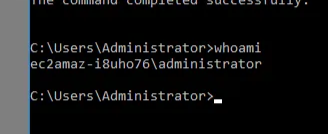

# Protocolo RDP en Windows y Enumeración Básica del Sistema

Maquinas a usar **Kali Linux y Laboratorio de Try Hack Me Investigatin Windows.**([https://tryhackme.com/room/investigatingwindows](https://tryhackme.com/room/investigatingwindows))

<aside>
💡

El **Protocolo RDP** (Remote Desktop Protocol) en Windows permite a los usuarios **conectarse de forma remota y grafica** a otros equipos, brindando acceso a su escritorio y aplicaciones como si estuvieran físicamente presentes. Es muy utilizado para administración remota y soporte técnico.
Por defecto, RDP utiliza el **puerto 3389** para establecer la conexión. Sin embargo, este puerto puede cambiarse manualmente por razones de seguridad o configuración personalizada. 

</aside>

Vamos a **suponer** que hemos **conseguido usuario y contraseña** de un usuario en **Windows** y que veamos que el **puerto 3389** esta **abierto**.

**Username: Administrator
Password: letmein123!**

```bash
sudo nmap -p- -sS -sV -sC --open -min-rate 5000 -n -vvv -Pn 10.10.220.216
```


- Usaríamos la herramienta **xfreerdp.**
    
    En mi caso la herramienta no la puedo emplear ya que no esta en Kali y no tengo opciones de instalarla pero dejo como seria el comando.
    
    ```bash
    xfreerdp /u:Administrator /p:letmein123! /v:10.10.220.216:3389
    ```
    

- Voy a usar la herramienta **xfreerdp3**
    
    ```bash
    xfreerdp3 /u:Administrator /p:letmein123! /v:10.10.220.216:3389
    ```
    
    
    
    <aside>
    💡
    
    **`xfreerdp3`**: Es la herramienta que estás usando, una versión específica de FreeRDP.
    
    **`/u:Administrator`**: Indica el nombre de usuario (en este caso, "Administrator").
    
    **`/p:letmein123!`**: Es la contraseña asociada al usuario.
    
    **`/v:10.10.220.216:3389`**: Especifica la dirección IP del servidor al que deseas conectarte y el puerto RDP (3389 es el estándar para conexiones RDP).
    
    </aside>
    
    <aside>
    💡
    
    **OJO** el usuario de la maquina remota vería lo que estamos haciendo.
    
    </aside>
    
    - Para saber información sobre la maquina.
        
        **about→ Clip derecho propiedades**
        
        
        
        
        
        
        
    
    - Saber que usuarios hay en la maquina **abrimos el CMD**.
        
        
        
    
    - Lista usuarios de la maquina.
        
        `net user`
        
        
        
    
    - Que usuario soy
        
        `whoami`
        
        
        
    
    - Información del usuario John
        
        `net user John`
        
        
        
    
    - Lista los usuarios dentro del grupo administrador
        
        **`net localgroup Administrators`**
        
        