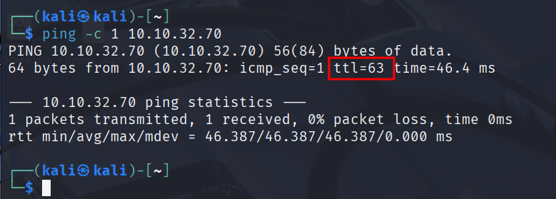

# Hacking en Entornos WordPress – Parte 1

Maquinas a utilizar **Kali Linux y Internal** [https://tryhackme.com/room/internal](https://tryhackme.com/room/internal)

<aside>
💡

WordPress es uno de los CMS más conocidos y populares a día de hoy, por lo que resulta fundamental mantenerlo protegido y securizado, aunque disponemos de herramientas como WPscan que nos permite realizar una auditoría de este CMS y poder enumerar tanto plugins vulnerables como usuarios existentes

</aside>

- Miramos si tenemos conectividad con la maquina victima.
    
    ```bash
    ping -c 1 10.10.32.70
    ```
    
    
    
    Vemos que es una maquina Linux.
    

```bash
nmap -p- -sS -sV -sC --open -min-rate=5000 -n -vvv -Pn 10.10.32.70
```


Como estamos ante un WordPress el puerto 80 esta abierto. 

- Nos vamos al navegador web ponemos la IP y miramos la web de WordPress. Nos muestra una plantilla de Apache.
    
    
    

- Vamos a revisar el código fuente por si encontramos comentarios o alguna pista. **Pulsamos CTRL+U**.
    
    
    
    No vemos nada significativo.
    
- Vamos a hacer **Fuzzing Web** para descubrir los subdirectorios**.**
    
    ```bash
    gobuster dir -u http://10.10.32.70/ -w /usr/share/wordlists/dirbuster/directory-list-lowercase-2.3-medium.txt
    ```
    
    
    

- Probamos en el navegador web estos dos directorios que hemos encontrado.
    
    
    
    
    

<aside>

Carga paginas muy parecidas pero debemos fijarnos en el detalle de que las **carga mal y contenido incompleto**. Esto **pasa por que hace falta que la IP de la maquina victima este apuntando al dominio de WordPress y muchisima información viene del dominio.**

Para ello debemos poner la URL en **/etc/hosts/**

</aside>

- ¿Cómo averiguamos la URL? miramos en el código fuente la pagina .
    
    
    
    Vemos que se repite en muchísimas ocasiones llama a **http:/internal.thm,** esto significa que hay un dominio. 
    
- Añadimos el dominio **http:/internal.thm** al archivo **/etc/hosts/.**
    
    ```bash
    sudo nano /etc/hosts 
    ```
    
    
    

- Refrescamos la pagina web por ejemplo la del blog. Y vemos que ya carga bien.
    
    
    

<aside>
💡

Cunado estamos en un WordPress hay una **ruta** que en la mayoría de las ocasiones suele estar **expuesta en paginas vulnerables**, se trata del **directorio wp-login**.

</aside>

- En el navegador web escribimos lo siguiente **`10.10.32.70/blog/wp-login`**
    
    
    
    Si no cargar como nos a ocurrido escribimos [`http://10.10.32.70/blog/wp-login.php`](./imagenes/http://10.10.32.70/blog/wp-login.php) .
    
    
    
    Esto también podríamos haberla encontrado haciendo **Fuzzing Web.**
    
    ```bash
    gobuster dir -u [http://10.10.32.70/blog/](./imagenes/http://10.10.32.70/blog/) -w /usr/share/wordlists/dirbuster/directory-list-lowercase-2.3-medium.txt -x php
    ```
    
    
    
- A partir de este punto debemos utilizar la herramienta **WPScan.** Supongamos que yo no se ni el usuario ni la contraseña. Con **WPScan** voy a **encontrar** **usuarios validos** que luego usare para hacer ataques de fuerza bruta.

<aside>
💡

**Continua en** **Hacking en Entornos WordPress – Parte 2**

</aside>