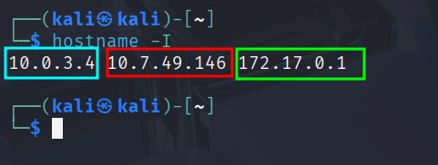

# Presentación del Mapa de Red

Cuando se hace la intrusión en una maquina hay que comprobar siempre las interfaces de red. 

- Con `Ifconfig` o `hostname -I` en equipos Linux y fijarse si hay mas de una interface de red .
    
    
    
    
    

- En Windows con `ipconfig`.
    
    
    

En caso de encontrar una segunda interface de red podríamos hacer **pivoting.**

Básicamente, es usar una máquina comprometida como un **punto de salto** para acceder a otros sistemas o redes que no eran accesibles directamente desde su posición original.

